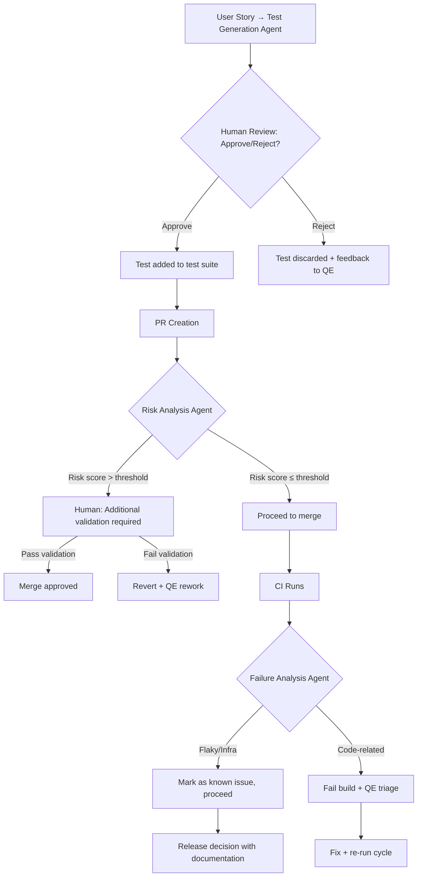

# 03-ai-quality-lab

## AI Quality Engineering Lab

### Sistema de Agentes con Gates de Aprobación Humana

#### Agentes Implementados

| Agente | Función | Input | Output |
|--------|---------|-------|--------|
| Test Generation | Genera steps de test desde user story | Historial, roles, acceptance criteria | Pasos de test en Given/When/Then |
| Risk Analysis | Identifica areas de riesgo en story | Descripción story, módulos afectados | Risk score + áreas críticas |
| PR Quality Analysis | Revisión automática de PR | Diff, coverage report, branch base | Comentario con sugerencias + riesgo score |
| Failure Analysis | Categoriza fallos de test | Test output, logs, error type | Categoría: flaky/infra/code/unclear + sugerencia |
| Missing-Test Detection | Detecta gaps de cobertura vs riesgo | Cobertura actual, risk matrix, historical defects | Lista de scenarios sin tests |

#### Riesgos Explicitos de IA (Documentados)

| Riesgo | Descripción | Mitigation / Gate |
|--------|-------------|-------------------|
| **Hallucinations** | Agente inventa endpoints o selectors que no existen | Validación contra spec/API docs real; fallo → reject automático |
| **False Coverage** | Agente reporta coverage % que no refleja realidad | Comparación contra cobertura real de herramienta (Istanbul/Playwright); human review required |
| **Weak Assertions** | Tests con assertions flojas (solo title check, no data validation) | Revisión humana de assertions antes de approve; minimum 3 assertions test |
| **Redundant Tests** | Generación de tests duplicados por stories similares | Deduplication por hash de test steps; bloqueo si overlap > 80% |
| **Happy-Path Bias** | Enfoque en escenarios exitosos, críticos omitidos | Explicit prompt: "Include negative paths"; automated check de coverage de negative paths |
| **Incorrect Assumptions** | Agente asume comportamiento sin validar | Assumption log visible en reporte; human must verify assumptions before merge |

#### Flujo de Trabajo con Gates Humanos



#### Ejemplo: Generación de Test (con riesgo documentado)

```typescript
// Generated by AI agent - requires human approval
// Risk: Hallucination - selectors validated against DOM structure
// Risk: Happy-path bias - negative paths explicitly included below

import { test, expect } from '@playwright/test';

test('US-123: Book appointment with valid data', async ({ page }) => {
  // Agent generated: Navigate to /appointments
  await page.goto('/appointments');
  
  // Filled by human: Added validation error assertion
  await page.fill('#patient-name', 'John Doe');
  await page.selectOption('#provider', 'dr-smith');
  await page.click('#book-btn');
  
  // Human assert: Verify success message AND error case
  await expect(page.locator('.success-message')).toHaveText('Appointment booked');
  
  // Redundancy check: This test covers happy + one negative path
});
```

#### Reporte de Riesgo por IA

```
AI Quality Report - US-123
===========================
Generated: 2024-01-15
Agent: test-generation-v1

Risk Flags: ✅ Validated, ⚠️ Assumption: provider availability
Hallucination Check: ✅ All selectors exist in spec
False Coverage Check: ✅ Actual 85% vs reported 85%
Weak Assertions: ❌ Only 1 assertion - requiere fix (approved with condition)
Redundancy Check: ✅ No overlapping tests found
Happy-Path Coverage: ✅ Negative path included (invalid patient ID)

Human Decision: ✅ APPROVED with condition: Add 2 more assertions for data validation
```

#### Métricas de Agentes

| Métrica | Valor Simulado | Meta |
|---------|---------------|------|
| Tests generados por agente | 24 por sprint | 15 minimum |
| Aprobación humana | 78% (20/24) | 100% approval required |
| Rejections por hallucinations | 3 tests | 0 (goal) |
| Redundant tests detectados | 2 pairs | 0 |
| Risk score avg | 3.2/5 | ≤ 3.0 |

#### Decisiones de Diseño

| Decision | Rationale |
|----------|-----------|
| Human approval gate for ALL generated tests | AI as assistant, not gatekeeper; risk too high otherwise |
| Explicit risk documentation per test | Makes invisible risks visible; builds trust in tooling |
| Deduplication before human review | Reduces noise; human reviews only novel tests |
| Risk analysis before merge, not after | Catch issues earlier in flow; cheaper to fix |
| Assumption log visible in report | Transparency sobre lo que AI asumió vs lo verificado |

#### Rationale: Why AI + Human, Not AI Alone

| Concern | Position |
|---------|----------|
| AI replaces QE role | No — AI reduce drudgery, human makes quality decisions |
| Full automation of test gen | Experiment → only con 100% validation gate; current portfolio muestra human-in-the-loop |
| AI can determine test coverage | Opinión → coverage sin risk context es misleading; AI-assisted pero human-verified |
| Automatic PR reviews | Opinión → AI sugiere, human aprueba; "rubber-stamping" unacceptable para Quality Lead role |

### Próximos Pasos

- [ ] Implementar Test Generation Agent con Playwright + TypeScript
- [ ] Crear Risk Analysis Agent usando NLP simple sobre historias
- [ ] Diseñar template de reporte de riesgo con flags documentados
- [ ] Configurar GitHub App o script que comente en PRs automáticamente
- [ ] Documentar "When to reject AI-generated tests" checklist para el equipo
